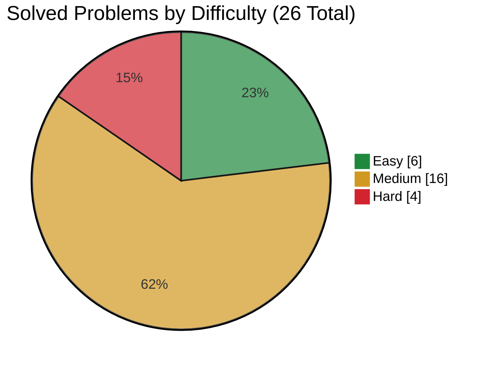

<div align="center">
  <h1>LeetCode Solutions</h1>

  <p>My Python solutions for the NeetCode All roadmap and focused company interview preparation.</p>

  <p>
    <a href="#neetcode-all-roadmap-progress">NeetCode All roadmap progress</a> ·
    <a href="#company-specific-preparation">Companies</a> ·
    <a href="#want-to-contribute">Want to contribute?</a>
  </p>

  <p>
    
    <!-- solved-count:start -->
    
    <!-- solved-count:end -->
    <!-- company-count:start -->
    
    <!-- company-count:end -->
    
  </p>
</div>

## What's this?

Nothing fancy, this is where I keep the problems I solve while following the [NeetCode All roadmap](https://neetcode.io/roadmap), alongside focused preparation for company OAs and technical interviews.

It gives me one place to track progress, revisit patterns, compare approaches, and keep my practice organized without relying on a single flat collection of solutions.

## NeetCode All roadmap progress

The roadmap totals are a snapshot of NeetCode All and may change as NeetCode adds or reorganizes problems.

Solved counts and difficulty statistics are generated from the completed entries in [SOLUTIONS.md](SOLUTIONS.md).

| Topic | Solved | Total |
|---|---:|---:|
| Arrays & Hashing | 9 | 175 |
| Two Pointers | 5 | 43 |
| Sliding Window | 6 | 41 |
| Stack | 6 | 39 |
| Binary Search | 0 | 43 |
| Linked List | 0 | 40 |
| Trees | 0 | 93 |
| Heap / Priority Queue | 0 | 33 |
| Backtracking | 0 | 36 |
| Tries | 0 | 12 |
| Graphs | 0 | 71 |
| Advanced Graphs | 0 | 30 |
| 1-D Dynamic Programming | 0 | 55 |
| 2-D Dynamic Programming | 0 | 50 |
| Greedy | 0 | 67 |
| Intervals | 0 | 21 |
| Math & Geometry | 0 | 63 |
| Bit Manipulation | 0 | 31 |
| JavaScript | 0 | 30 |
| **All topics** | <!-- progress-total:start -->**26**<!-- progress-total:end --> | **973** |

<!-- difficulty-chart:start -->

<!-- difficulty-chart:end -->

## Company-specific preparation

Company preparation lives in [`companies/`](companies/README.md) and is tracked separately from the year-round roadmap.

This keeps company-specific practice independent, so solving the same problem again for an OA or technical interview remains visible as a separate attempt.

<!-- company-progress:start -->
**1 company · 0 solved · 0 in progress · 0 planned**
<!-- company-progress:end -->

### Companies

<!-- company-list:start -->
| Company | Folder |
|---|---|
| Roblox | [`companies/roblox/`](companies/roblox/) |
<!-- company-list:end -->

The company tracker manages workspace creation, progress tables, and the `planned → in-progress → solved` workflow. It also validates that completed entries include a solution together with time and space complexity.

See the [company preparation guide](companies/README.md) for the complete workflow.

## Folder layout

Roadmap solutions are grouped by topic, while company preparation uses one tracked workspace per company:

```text
# NeetCode All roadmap solutions
neetcode-all/<topic>/<problem-number>.py

# Company preparation solutions
companies/<company-name>/solutions/<problem-id>.py
```

For example, a roadmap solution is [`neetcode-all/arrays&hashing/217.py`](neetcode-all/arrays%26hashing/217.py).

Company attempts follow the same direct Python style but remain inside their company-specific workspace.

## Solution style

Everything is written in Python 3 unless a problem specifically requires another language.

I keep solutions direct, readable, and easy to explain in an interview. This is a study repository rather than a production package, so clear reasoning and understandable implementations matter more than clever abstractions.

## Want to contribute?

Nice! Have a look at [CONTRIBUTING.md](CONTRIBUTING.md). Fixes, clearer approaches, documentation improvements, and useful new roadmap or company-preparation solutions are all welcome.

Please also follow the [Code of Conduct](CODE_OF_CONDUCT.md) when participating in the project.

## License

Licensed under the [MIT License](LICENSE).

## Contributors

<p align="center">
  <a href="https://github.com/simonesiega/leetcode-solutions/graphs/contributors">
    
  </a>
</p>
