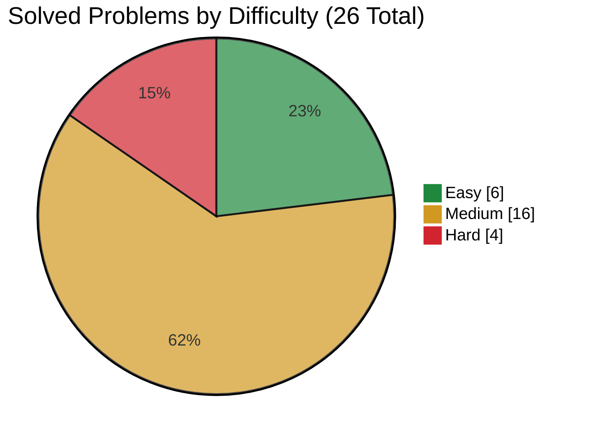
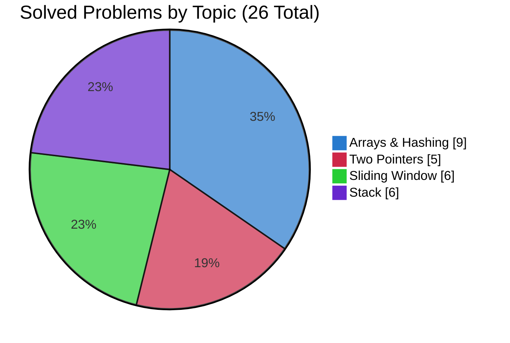

<div align="center">
  <h1>LeetCode Solutions</h1>

  <p>My LeetCode solutions in Python while I work through NeetCode and prepare for interviews.</p>

  <p>
    <a href="#neetcode-progress">NeetCode progress</a> ·
    <a href="SOLUTIONS.md">Solutions</a> ·
    <a href="#company-prep">Companies</a> ·
    <a href="#want-to-contribute">Want to contribute?</a>
  </p>

  <p>
    
    <!-- solved-count:start -->
    
    <!-- solved-count:end -->
    <!-- company-count:start -->
    
    <!-- company-count:end -->
    
  </p>
</div>

## What's this?

Nothing fancy, this is where I keep the LeetCode problems I solve while working through the [NeetCode All roadmap](https://neetcode.io/roadmap) and preparing for OAs and interviews.

Mostly here so I can keep track of what I’ve done, come back to old problems, and hopefully see myself getting better over time.

## NeetCode progress

The roadmap totals are a snapshot of NeetCode All and may change as NeetCode adds or reorganizes problems.

[`data/roadmap.json`](data/roadmap.json) keeps the roadmap data in one place. The generator checks it against the solution files, then uses it to build [SOLUTIONS.md](SOLUTIONS.md), update the solved counts, and generate the README charts and topic table.

<!-- difficulty-chart:start -->

<!-- difficulty-chart:end -->

<!-- topic-chart:start -->

<!-- topic-chart:end -->

### Progress by topic

Open the table below to see solved and total problem counts for every roadmap topic.

<details>
<summary><strong>View detailed topic progress</strong></summary>

<!-- topic-table:start -->
| Topic | Solved | Total |
|---|---:|---:|
| Arrays & Hashing | 9 | 175 |
| Two Pointers | 5 | 43 |
| Sliding Window | 6 | 41 |
| Stack | 6 | 39 |
| Binary Search | 0 | 43 |
| Linked List | 0 | 40 |
| Trees | 0 | 93 |
| Heap / Priority Queue | 0 | 33 |
| Backtracking | 0 | 36 |
| Tries | 0 | 12 |
| Graphs | 0 | 71 |
| Advanced Graphs | 0 | 30 |
| 1-D Dynamic Programming | 0 | 55 |
| 2-D Dynamic Programming | 0 | 50 |
| Greedy | 0 | 67 |
| Intervals | 0 | 21 |
| Math & Geometry | 0 | 63 |
| Bit Manipulation | 0 | 31 |
| **All topics** | <!-- progress-total:start -->**26**<!-- progress-total:end --> | **973** |
<!-- topic-table:end -->

</details>

## Company prep

I also keep some separate practice for specific companies in [`companies/`](companies/README.md).

If I solve the same problem again while preparing for an OA or interview, I keep that attempt separate. I like being able to see how I approached the same problem at different times.

<!-- company-progress:start -->
**1 company · 3 solved · 0 in progress · 0 planned**
<!-- company-progress:end -->

### Companies

<!-- company-list:start -->
| Company | Folder |
|---|---|
| Roblox | [`companies/roblox/`](companies/roblox/) |
<!-- company-list:end -->

There’s also a small tracker behind this so I don’t have to update everything by hand. It keeps track of `planned → in-progress → solved` problems and checks that solved ones include the solution, time complexity, and space complexity.

If you’re curious, the full setup is in the [company prep guide](companies/README.md).

## Folder layout

NeetCode solutions are grouped by topic, while company prep gets its own folder for each company:

```text
# Roadmap metadata
data/roadmap.json

# NeetCode All roadmap solutions
neetcode-all/<topic-slug>/<problem-number>.py

# Company preparation solutions
companies/<company-name>/solutions/<problem-id>.py
```

For example, a roadmap solution is [`neetcode-all/arrays-and-hashing/217.py`](neetcode-all/arrays-and-hashing/217.py).

Company attempts use the same simple Python style, but they stay inside their own company folder.

## How I write my solutions

Everything is Python 3 unless I have a reason to use something else.

I try to keep the solutions simple and readable — basically code I’d be comfortable explaining out loud in an interview. I’m not trying to write the cleverest one-liner possible.

## Want to contribute?

Found a mistake or have a cleaner solution? Feel free to open a PR. Have a look at [CONTRIBUTING.md](CONTRIBUTING.md) first so everything stays consistent.

## Problem references

Solution files identify each problem only by its title and ID. For the full statement, examples, and constraints, use the official link in [SOLUTIONS.md](SOLUTIONS.md) or the relevant company dashboard.

## License

The repository’s original code and documentation are licensed under the [MIT License](LICENSE). Third-party content, platform names, and trademarks remain the property of their respective owners.

## Contributors

<p align="center">
  <a href="https://github.com/simonesiega/leetcode-solutions/graphs/contributors">
    
  </a>
</p>
