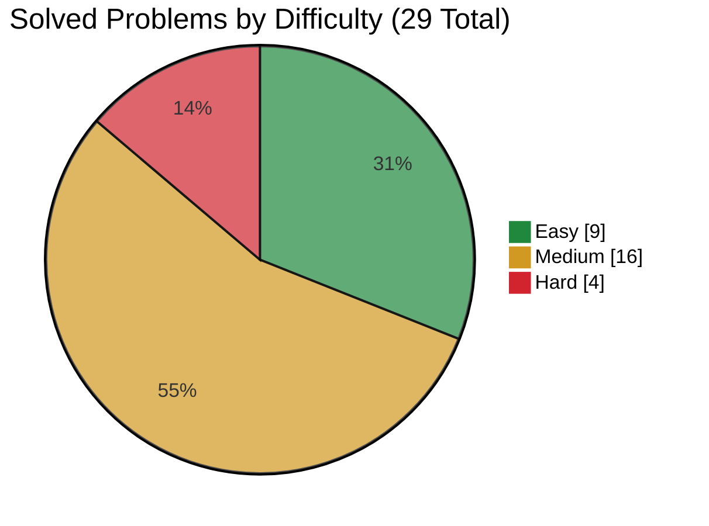
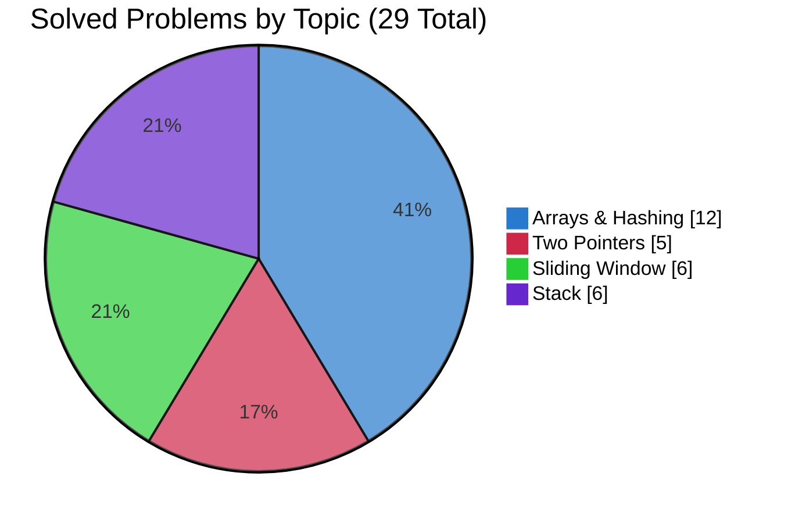

  <h1>LeetCode Solutions</h1>

  
My LeetCode solutions in Python while I work through NeetCode and prepare for interviews.

  

    <a href="#personal-difficulty-rating">Difficulty rating</a> ·
    <a href="#neetcode-progress">NeetCode progress</a> ·
    <a href="SOLUTIONS.md">Solutions</a> ·
    <a href="#company-prep">Companies</a> ·
    <a href="#want-to-contribute">Want to contribute?</a>
  

  

    
    <!-- solved-count:start -->
    
    <!-- solved-count:end -->
    <!-- company-count:start -->
    
    <!-- company-count:end -->
    
  

## What's this?

Nothing fancy. This is where I keep the LeetCode problems I solve while working through the [NeetCode All roadmap](https://neetcode.io/roadmap) and preparing for OAs and interviews.

The repo keeps progress, complexity notes, solve dates, personal difficulty, and company-specific practice in sync so I can mostly focus on solving problems and come back later to see how I’ve improved.

## Personal difficulty rating

For both **NeetCode roadmap problems** and **company-specific practice**, I can assign an optional personal difficulty score from **1 to 10**.

It represents how difficult it felt to derive a correct and reasonably optimal solution from scratch, not how difficult the implementation looks after the solution is known.

<strong>View the rating scale</strong>

| Rating | Level | Meaning |
|---:|---|---|
| **1** | Immediate | I see the solution almost instantly. The right data structure or algorithm is obvious, with almost no real reasoning required. |
| **2** | Easy | I need a little thought, but the approach appears naturally. There may be small implementation details or edge cases, but no important hidden insight. |
| **3** | Comfortable | I need to recognize a known pattern, but once I identify it, the solution follows naturally. I can usually derive it independently without getting stuck. |
| **4** | Moderate | The solution is not immediately obvious. I need to explore the problem, identify the right pattern, or make one useful observation before the approach becomes clear. |
| **5** | Significant insight | The problem depends on one important idea that I may not discover immediately. I may spend a meaningful amount of time exploring before finding the key insight. |
| **6** | Difficult | The problem requires a non-obvious insight, several coordinated steps, or tricky implementation. Deriving the full solution from scratch in an interview would be uncertain. |
| **7** | Very difficult | The optimal solution relies on a technique or invariant that I am unlikely to discover quickly. Even recognizing the general category may not be enough to reach the full algorithm. |
| **8** | Major non-obvious insight | The solution requires changing how I initially view the problem or combining several important deductions. Missing one of them can prevent me from reaching the intended approach. |
| **9** | Extremely hard to derive | I would probably not reach the intended optimal solution from scratch under interview pressure and would likely need a substantial hint. |
| **10** | No realistic path from scratch | I would have essentially no path to the intended solution without seeing a major part of the idea first. The required technique or transformation is outside my current problem-solving instincts. |

Because the rating is personal, it can change as I become more familiar with a pattern. A LeetCode **Hard** can receive a relatively low score if its core idea feels natural to me, while a **Medium** can receive a higher score if its main insight is difficult to discover.

## NeetCode progress

<!-- roadmap-snapshot:start -->
The roadmap totals are a snapshot of NeetCode All captured on September 14, 2026 and may change as NeetCode adds or reorganizes problems.
<!-- roadmap-snapshot:end -->

The full solved catalog, including complexity and solve dates, is in [SOLUTIONS.md](SOLUTIONS.md).

<!-- difficulty-chart:start -->

<!-- difficulty-chart:end -->

<!-- topic-chart:start -->

<!-- topic-chart:end -->

### Progress by topic

If you want to see the full topic breakdown, including solved counts and links to solutions, click below.

<strong>View detailed topic progress</strong>

<!-- topic-table:start -->
| Topic | Solved | Total | Solutions |
|---|---:|---:|:---:|
| Arrays & Hashing | 12 | 175 | [View](SOLUTIONS.md#arrays-and-hashing) |
| Two Pointers | 5 | 43 | [View](SOLUTIONS.md#two-pointers) |
| Sliding Window | 6 | 41 | [View](SOLUTIONS.md#sliding-window) |
| Stack | 6 | 39 | [View](SOLUTIONS.md#stack) |
| Binary Search | 0 | 43 | [View](SOLUTIONS.md#binary-search) |
| Linked List | 0 | 40 | [View](SOLUTIONS.md#linked-list) |
| Trees | 0 | 93 | [View](SOLUTIONS.md#trees) |
| Heap / Priority Queue | 0 | 33 | [View](SOLUTIONS.md#heap-priority-queue) |
| Backtracking | 0 | 36 | [View](SOLUTIONS.md#backtracking) |
| Tries | 0 | 12 | [View](SOLUTIONS.md#tries) |
| Graphs | 0 | 71 | [View](SOLUTIONS.md#graphs) |
| Advanced Graphs | 0 | 30 | [View](SOLUTIONS.md#advanced-graphs) |
| 1-D Dynamic Programming | 0 | 55 | [View](SOLUTIONS.md#1d-dynamic-programming) |
| 2-D Dynamic Programming | 0 | 50 | [View](SOLUTIONS.md#2d-dynamic-programming) |
| Greedy | 0 | 67 | [View](SOLUTIONS.md#greedy) |
| Intervals | 0 | 21 | [View](SOLUTIONS.md#intervals) |
| Math & Geometry | 0 | 63 | [View](SOLUTIONS.md#math-and-geometry) |
| Bit Manipulation | 0 | 31 | [View](SOLUTIONS.md#bit-manipulation) |
| **All topics** | <!-- progress-total:start -->**29**<!-- progress-total:end --> | **943** | [Browse all](SOLUTIONS.md) |
<!-- topic-table:end -->

## Company prep

I also keep some separate practice for specific companies in [`companies/`](companies/README.md).

For company-specific practice, I often use [liquidslr/leetcode-company-wise-problems](https://github.com/liquidslr/leetcode-company-wise-problems) as the problem source and work through each company's list from highest reported frequency to lowest.

If I solve the same problem again while preparing for an OA or interview, I keep that attempt separate. I like being able to see how I approached the same problem at different times.

<!-- company-progress:start -->
**2 companies · 12 solved · 0 in progress · 0 planned**
<!-- company-progress:end -->

### Companies

<!-- company-list:start -->
| Company | Folder |
|---|---|
| IBM | [`companies/ibm/`](companies/ibm/) |
| Roblox | [`companies/roblox/`](companies/roblox/) |
<!-- company-list:end -->

You can find more information in the [company prep guide](companies/README.md).

## How I write my solutions

Everything is Python 3 unless I have a reason to use something else.

I try to keep the solutions simple and readable: basically code I’d be comfortable explaining out loud in an interview. I’m not trying to write the cleverest one-liner possible.

## Want to contribute?

Found a mistake or have a cleaner solution? Feel free to open a PR. Have a look at [CONTRIBUTING.md](CONTRIBUTING.md) first so everything stays consistent.

If you want, you can also fill out the [Pull Request template](.github/pull_request_template.md) to provide more context for your changes.

## License

The repository’s original code and documentation are licensed under the [MIT License](LICENSE). Third-party content, platform names, and trademarks remain the property of their respective owners.

## Contributors

Thanks to all the people who have contributed to this project!

  

