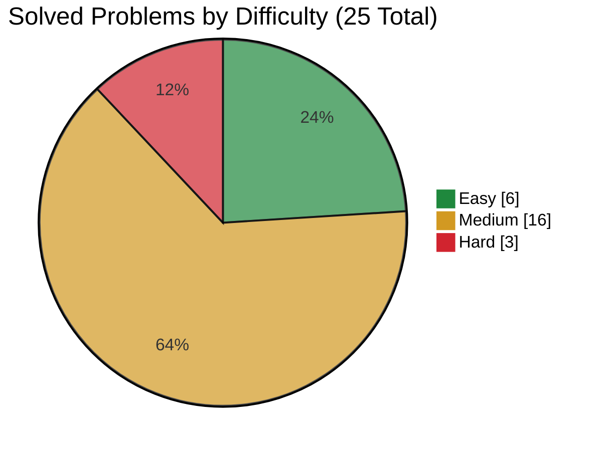

<div align="center">
  

  <h1>LeetCode Solutions</h1>

  <p>Roadmap-based Python 3 solutions for data structures, algorithms, and technical interview preparation.</p>

  <p>
    
    
    <!-- solved-count:start -->
    
    <!-- solved-count:end -->
    
  </p>
</div>

## Contents

- [Overview](#overview)
- [Current Progress](#current-progress)
- [Organization](#organization)
- [Solution Style](#solution-style)
- [Contributing](#contributing)
- [Contributors](#contributors)
- [License](#license)

## Overview

This repository is my personal LeetCode workspace, built to study data structures and algorithms in a structured way.

Instead of collecting solutions in one flat folder, problems are grouped by roadmap and topic.
The current roadmap follows `neetcode-150`, based on the [NeetCode roadmap](https://neetcode.io/roadmap).

## Current Progress

This repository is updated regularly as I solve new problems. The solved badge and difficulty chart are generated from the solution index in [SOLUTIONS.md](SOLUTIONS.md); topic progress is maintained manually.

| Roadmap | Topic | Solved |
|---|---|---:|
| `neetcode-150` | Arrays & Hashing | 9 |
| `neetcode-150` | Two Pointers | 5 |
| `neetcode-150` | Stack | 6 |
| `neetcode-150` | Sliding Window | 5 |

Current solved problems, including their solution files, complexities, and color-coded difficulties, are listed in [SOLUTIONS.md](SOLUTIONS.md).

<!-- difficulty-chart:start -->

<!-- difficulty-chart:end -->

## Organization

The repository is organized around a clear path from roadmap to topic to individual problem. Each file belongs to a specific preparation roadmap, then to the topic that problem is meant to practice, and finally to the LeetCode problem number.

```text
roadmap / topic / problem-number.py
```

Example:

```text
neetcode-150 / arrays&hashing / 217.py
```

This makes the repository easy to scan and expand over time. Related problems stay close to each other, so it is easier to compare approaches, recognize repeated patterns, and review progress topic by topic.

## Solution Style

All solutions are written in `Python 3`.

The style is intentionally simple. These are interview-practice solutions, so the focus is on clarity, direct implementation, and understanding the core idea behind each problem.

This repository is not a package, framework, or production library. It is a structured archive of solved problems and learning progress.

## Contributing

For information on how to contribute, see [CONTRIBUTING.md](CONTRIBUTING.md).

## Contributors

<p align="center">
  <a href="https://github.com/simonesiega/leetcode-solutions/graphs/contributors">
    
  </a>
</p>

## License

Licensed under the [MIT License](LICENSE).