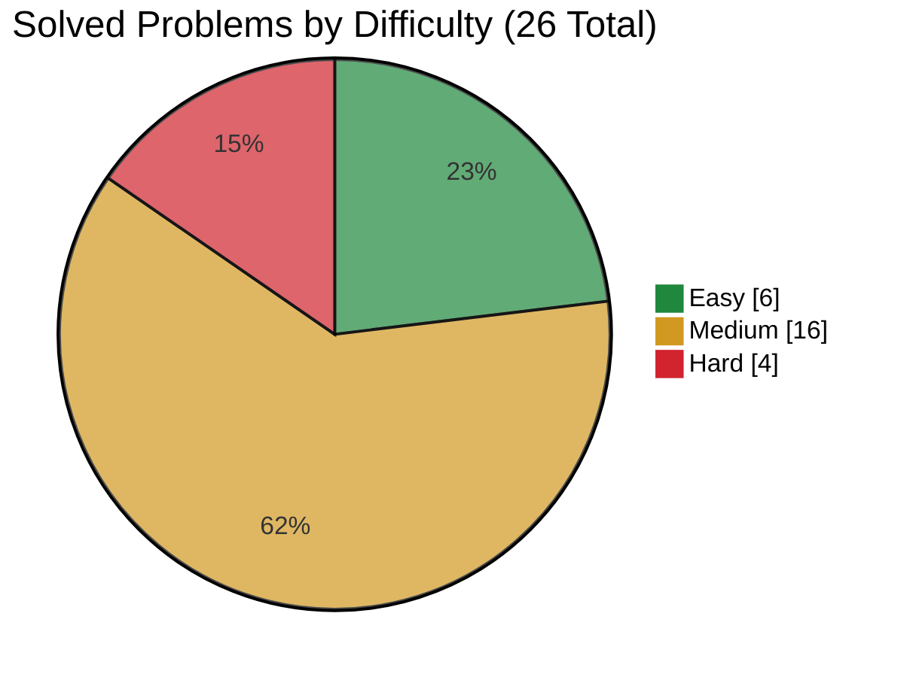

<div align="center">
  <h1>LeetCode Solutions</h1>

  <p>My Python solutions while I work through the NeetCode All roadmap.</p>

  <p>
    
    
    <!-- solved-count:start -->
    
    <!-- solved-count:end -->
    
  </p>
</div>

## What's this?

Nothing fancy—this is where I keep the problems I solve while following the [NeetCode All roadmap](https://neetcode.io/roadmap). It gives me one place to track progress, revisit old patterns, and compare solutions without digging through a giant flat folder.

## Progress

The roadmap totals are a snapshot of NeetCode All and may grow as NeetCode adds problems. Solved counts come from the Python files currently in this repo.

| Topic | Solved | Total |
|---|---:|---:|
| Arrays & Hashing | 9 | 175 |
| Two Pointers | 5 | 43 |
| Sliding Window | 6 | 41 |
| Stack | 6 | 39 |
| Binary Search | 0 | 43 |
| Linked List | 0 | 40 |
| Trees | 0 | 93 |
| Heap / Priority Queue | 0 | 33 |
| Backtracking | 0 | 36 |
| Tries | 0 | 12 |
| Graphs | 0 | 71 |
| Advanced Graphs | 0 | 30 |
| 1-D Dynamic Programming | 0 | 55 |
| 2-D Dynamic Programming | 0 | 50 |
| Greedy | 0 | 67 |
| Intervals | 0 | 21 |
| Math & Geometry | 0 | 63 |
| Bit Manipulation | 0 | 31 |
| JavaScript | 0 | 30 |
| **All topics** | <!-- progress-total:start -->**26**<!-- progress-total:end --> | **973** |

For links, difficulty, and complexity notes for each solved problem, check [SOLUTIONS.md](SOLUTIONS.md).

<!-- difficulty-chart:start -->

<!-- difficulty-chart:end -->

## Folder layout

Solutions are grouped by topic and named with the LeetCode problem number:

```text
neetcode-all / topic / problem-number.py
```

For example:

```text
neetcode-all / arrays&hashing / 217.py
```

It is a little more readable in an actual link: [`neetcode-all/arrays&hashing/217.py`](neetcode-all/arrays%26hashing/217.py).

## Solution style

Everything is Python 3 unless a roadmap problem specifically requires another language. I try to keep solutions direct, readable, and easy to talk through in an interview. This is a study notebook, not a production package, so clear ideas beat clever abstractions.

## Want to contribute?

Nice! Have a look at [CONTRIBUTING.md](CONTRIBUTING.md). Fixes, clearer approaches, and new roadmap solutions are welcome.

## Contributors

<p align="center">
  <a href="https://github.com/simonesiega/leetcode-solutions/graphs/contributors">
    
  </a>
</p>

## License

Licensed under the [MIT License](LICENSE).
