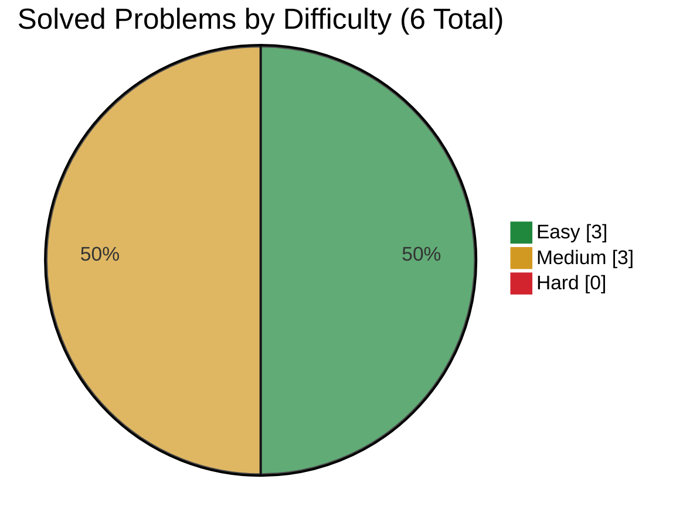

# IBM

> This file is generated from [`company.json`](company.json). Do not edit it directly.

[← Companies](../README.md) · [Project README](../../README.md)

## Progress

- **Solved:** 6 / 6
- **In progress:** 0
- **Planned:** 0



| ID | Problem | Difficulty | Personal Difficulty | Status | Solution | Time | Space | Notes |
|---|---|:---:|:---:|:---:|---|---|---|---|
| 1 | [Two Sum](https://leetcode.com/problems/two-sum/) | Easy | 1 | Solved | [1.py](solutions/1.py) | O(n), where n is the number of values | O(n) for the value-to-index map | n = the number of input values |
| 3 | [Longest Substring Without Repeating Characters](https://leetcode.com/problems/longest-substring-without-repeating-characters/) | Medium | 3 | Solved | [3.py](solutions/3.py) | O(n), where n is the string length | O(min(n, a)) for the sliding-window set | n = the string length; a = the character-set size |
| 12 | [Integer to Roman](https://leetcode.com/problems/integer-to-roman/) | Medium | 3 | Solved | [12.py](solutions/12.py) | O(1) because the input is bounded by 3999 | O(1) auxiliary space | The Roman numeral symbol table and maximum output length are bounded by the problem constraints |
| 56 | [Merge Intervals](https://leetcode.com/problems/merge-intervals/) | Medium | 3 | Solved | [56.py](solutions/56.py) | O(n log n), where n is the number of intervals | O(n) for the returned merged intervals | n = the number of intervals |
| 121 | [Best Time to Buy and Sell Stock](https://leetcode.com/problems/best-time-to-buy-and-sell-stock/) | Easy | 2 | Solved | [121.py](solutions/121.py) | O(n), where n is the number of prices | O(1) auxiliary space | n = the number of daily stock prices |
| 412 | [Fizz Buzz](https://leetcode.com/problems/fizz-buzz/) | Easy | 1 | Solved | [412.py](solutions/412.py) | O(n) | O(1) auxiliary; O(n) including the output | n = the input integer and number of generated entries |

## Commands

```bash
node scripts/company-tracker.js add-problem ibm <id> "<title>" <Easy|Medium|Hard> [--personal-difficulty 1-10] [--url URL]
node scripts/company-tracker.js start ibm <id>
node scripts/company-tracker.js solve ibm <id> --time "O(...)" --space "O(...)" [--personal-difficulty 1-10]
```
