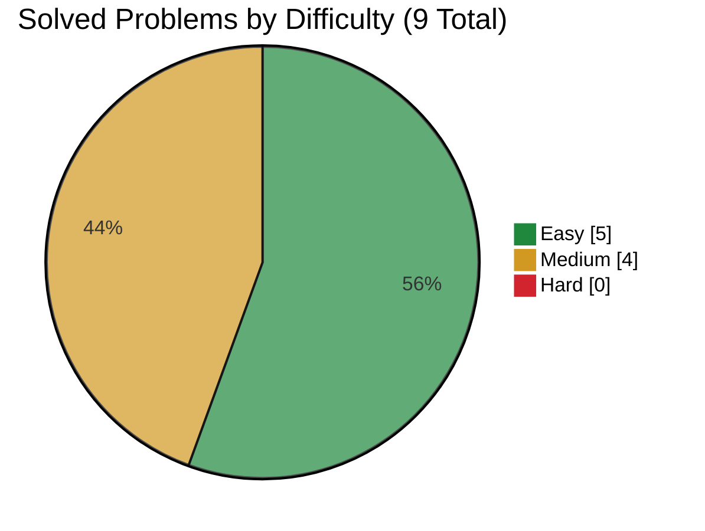

# IBM

> This file is generated from [`company.json`](company.json). Do not edit it directly.

[← Companies](../README.md) · [Project README](../../README.md)

**Source:** [liquidslr/leetcode-company-wise-problems](https://github.com/liquidslr/leetcode-company-wise-problems) · **Window:** all · **Snapshot:** August 16, 2026 · **Commit:** [`03850eb5d168`](https://github.com/liquidslr/leetcode-company-wise-problems/commit/03850eb5d16892514491cf1381c32ec0330a2719)

## Progress

- **Solved:** 9 / 9
- **In progress:** 0
- **Planned:** 0



| Rank | Problem | Frequency | Difficulty | Status | Personal | Solution |
|---:|---|---:|:---:|:---:|:---:|---|
| 1 | [Fizz Buzz](https://leetcode.com/problems/fizz-buzz/) | 100.0% | Easy | Solved | 1 | [412.py](solutions/412.py) |
| 2 | [Merge Intervals](https://leetcode.com/problems/merge-intervals/) | 93.8% | Medium | Solved | 3 | [56.py](solutions/56.py) |
| 3 | [Integer to Roman](https://leetcode.com/problems/integer-to-roman/) | 91.3% | Medium | Solved | 3 | [12.py](solutions/12.py) |
| 4 | [Longest Substring Without Repeating Characters](https://leetcode.com/problems/longest-substring-without-repeating-characters/) | 87.5% | Medium | Solved | 3 | [3.py](solutions/3.py) |
| 5 | [Best Time to Buy and Sell Stock](https://leetcode.com/problems/best-time-to-buy-and-sell-stock/) | 86.5% | Easy | Solved | 2 | [121.py](solutions/121.py) |
| 6 | [Two Sum](https://leetcode.com/problems/two-sum/) | 85.4% | Easy | Solved | 1 | [1.py](solutions/1.py) |
| 7 | [Roman to Integer](https://leetcode.com/problems/roman-to-integer/) | 82.9% | Easy | Solved | 2 | [13.py](solutions/13.py) |
| 8 | [Valid Parentheses](https://leetcode.com/problems/valid-parentheses/) | 81.6% | Easy | Solved | 2 | [20.py](solutions/20.py) |
| 9 | [Count Ways to Group Overlapping Ranges](https://leetcode.com/problems/count-ways-to-group-overlapping-ranges/) | 81.6% | Medium | Solved | 4 | [2580.py](solutions/2580.py) |

## Attempt details

| ID | Time | Space | Notes |
|---|---|---|---|
| 412 | O(n) | O(1) auxiliary; O(n) including the output | n = the input integer and number of generated entries |
| 56 | O(n log n), where n is the number of intervals | O(n) worst-case auxiliary space for Python's in-place sort and the intervals\[1:\] slice; O(n) for the returned list of interval references | n = the number of intervals |
| 12 | O(1) because the input is bounded by 3999 | O(1) auxiliary space | The Roman numeral symbol table and maximum output length are bounded by the problem constraints |
| 3 | O(n), where n is the string length | O(min(n, a)) for the sliding-window set | n = the string length; a = the character-set size |
| 121 | O(n), where n is the number of prices | O(1) auxiliary space | n = the number of daily stock prices |
| 1 | O(n), where n is the number of values | O(n) for the value-to-index map | n = the number of input values |
| 13 | O(n), where n is the Roman numeral length | O(1) auxiliary space | n = the number of Roman numeral characters |
| 20 | O(n), where n is the string length | O(n) worst-case auxiliary space for the stack | n = the string length; in the worst case, every character is an opening bracket |
| 2580 | O(n log n), where n is the number of ranges | O(n) worst-case auxiliary space for Python's in-place sort; O(1) auxiliary space excluding sorting | n = the number of ranges |

## Commands

```bash
node scripts/company-tracker.js source-sync ibm
node scripts/company-tracker.js next ibm
node scripts/company-tracker.js add-from-source ibm <source-key> [--id problem-id]
node scripts/company-tracker.js add-problem ibm <id> "<title>" <Easy|Medium|Hard> [--url URL]
node scripts/company-tracker.js start ibm <id>
node scripts/company-tracker.js solve ibm <id> --time "O(...)" --space "O(...)" [--personal-difficulty 1-10]
```
