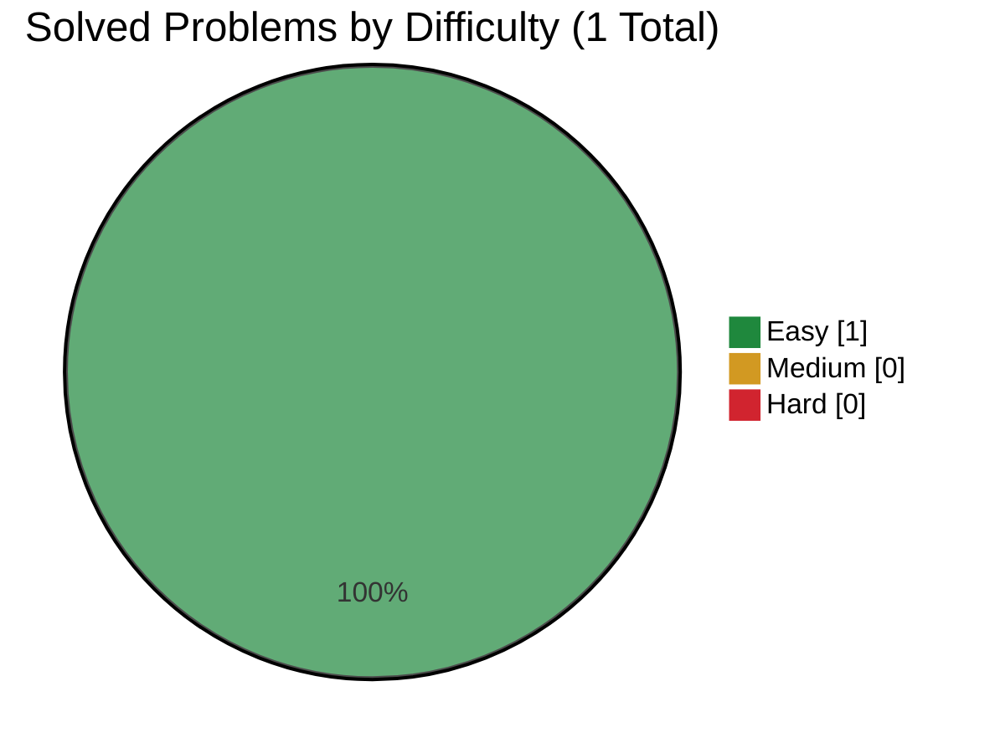

# IBM

> This file is generated from [`company.json`](company.json). Do not edit it directly.

[← Companies](../README.md) · [Project README](../../README.md)

## Progress

- **Solved:** 1 / 1
- **In progress:** 0
- **Planned:** 0



| ID | Problem | Difficulty | Personal Difficulty | Status | Solution | Time | Space | Notes |
|---|---|:---:|:---:|:---:|---|---|---|---|
| 412 | [Fizz Buzz](https://leetcode.com/problems/fizz-buzz/) | Easy | 1 | Solved | [412.py](solutions/412.py) | O(n) | O(1) auxiliary; O(n) including the output | n = the input integer and number of generated entries |

## Commands

```bash
node scripts/company-tracker.js add-problem ibm <id> "<title>" <Easy|Medium|Hard> [--personal-difficulty 1-10] [--url URL]
node scripts/company-tracker.js start ibm <id>
node scripts/company-tracker.js solve ibm <id> --time "O(...)" --space "O(...)" [--personal-difficulty 1-10]
```
