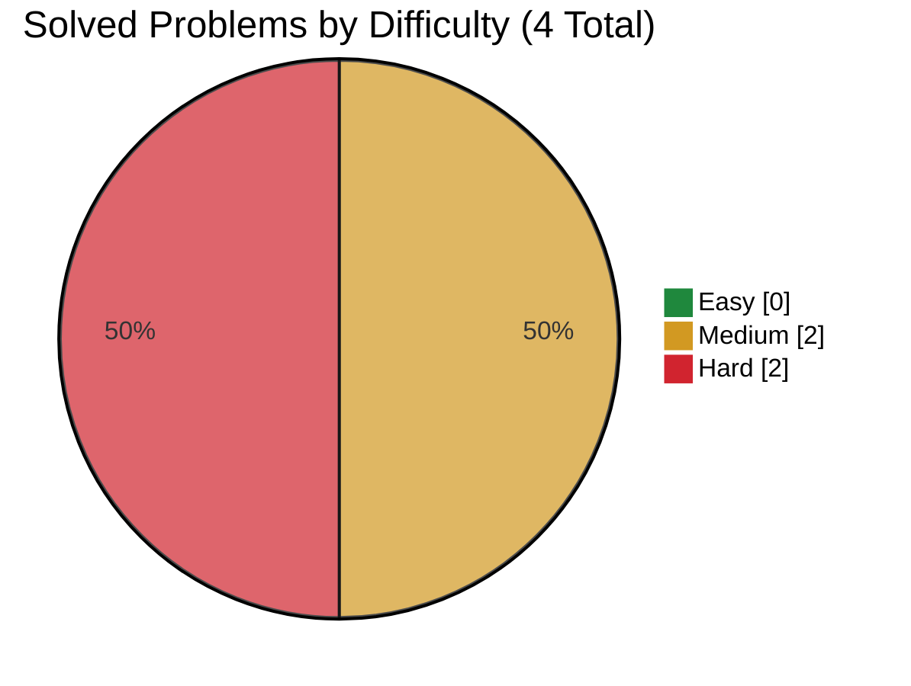

# Roblox

> This file is generated from [`company.json`](company.json). Do not edit it directly.

[← Companies](../README.md) · [Project README](../../README.md)

**Focus:** America OA

## Progress

- **Solved:** 4 / 4
- **In progress:** 0
- **Planned:** 0



| ID | Problem | Difficulty | Personal Difficulty | Status | Solution | Time | Space | Notes |
|---|---|:---:|:---:|:---:|---|---|---|---|
| 68 | [Text Justification](https://leetcode.com/problems/text-justification/) | Hard | 5 | Solved | [68.py](solutions/68.py) | O(nw) | O(w) | n = number of characters in the returned output; w = maxWidth; auxiliary space excludes the returned output |
| 723 | [Candy Crush](https://leetcode.com/problems/candy-crush/) | Medium | 6 | Solved | [723.py](solutions/723.py) | O(kmn), worst-case O((mn)^2) | O(1) | k = number of crush rounds |
| 767 | [Reorganize String](https://leetcode.com/problems/reorganize-string/) | Medium | 4 | Solved | [767.py](solutions/767.py) | O(n + k log k) | O(n + k) | k = number of distinct characters |
| 1434 | [Number of Ways to Wear Different Hats to Each Other](https://leetcode.com/problems/number-of-ways-to-wear-different-hats-to-each-other/) | Hard | 8 | Solved | [1434.py](solutions/1434.py) | O(Hp2^p) | O(H2^p + Hp) | H = 40 possible hats; p = number of people; space includes memoization and the hat-to-people mapping |

## Commands

```bash
node scripts/company-tracker.js add-problem roblox <id> "<title>" <Easy|Medium|Hard> [--personal-difficulty 1-10] [--url URL]
node scripts/company-tracker.js start roblox <id>
node scripts/company-tracker.js solve roblox <id> --time "O(...)" --space "O(...)" [--personal-difficulty 1-10]
```
