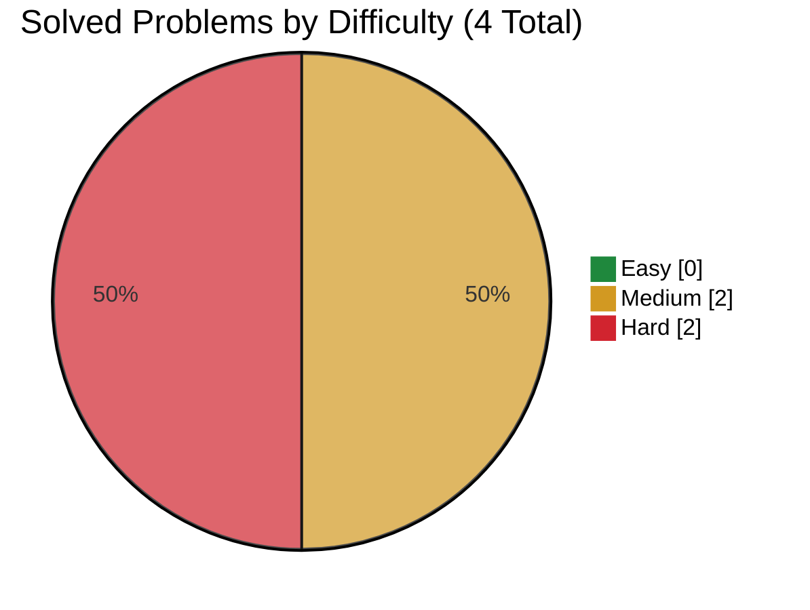

# Roblox

> This file is generated from [`company.json`](company.json). Do not edit it directly.

[← Companies](../README.md) · [Project README](../../README.md)

**Focus:** America OA

**Source:** [liquidslr/leetcode-company-wise-problems](https://github.com/liquidslr/leetcode-company-wise-problems) · **Window:** all · **Snapshot:** August 16, 2026 · **Commit:** [`03850eb5d168`](https://github.com/liquidslr/leetcode-company-wise-problems/commit/03850eb5d16892514491cf1381c32ec0330a2719)

## Progress

- **Solved:** 4 / 4
- **In progress:** 0
- **Planned:** 0



| Rank | Problem | Frequency | Difficulty | Status | Personal | Solution |
|---:|---|---:|:---:|:---:|:---:|---|
| 1 | [Candy Crush](https://leetcode.com/problems/candy-crush/) | 100.0% | Medium | Solved | 6 | [723.py](solutions/723.py) |
| 2 | [Reorganize String](https://leetcode.com/problems/reorganize-string/) | 92.2% | Medium | Solved | 4 | [767.py](solutions/767.py) |
| 3 | [Number of Ways to Wear Different Hats to Each Other](https://leetcode.com/problems/number-of-ways-to-wear-different-hats-to-each-other/) | 91.5% | Hard | Solved | 8 | [1434.py](solutions/1434.py) |
| 4 | [Text Justification](https://leetcode.com/problems/text-justification/) | 87.7% | Hard | Solved | 5 | [68.py](solutions/68.py) |

## Attempt details

| ID | Time | Space | Notes |
|---|---|---|---|
| 723 | O((k + 1)mn), worst-case O((mn)^2) | O(1) | m = number of board rows; n = number of columns; k = number of crush rounds |
| 767 | O(n + k log k) | O(n + k) | n = length of s; k = number of distinct characters |
| 1434 | O(Hp2^p) | O(H2^p + Hp) | H = 40 possible hats; p = number of people; space includes memoization and the hat-to-people mapping |
| 68 | O(nw) | O(w) | n = number of characters in the returned output; w = maxWidth; auxiliary space excludes the returned output |

## Commands

```bash
node scripts/company-tracker.js source-sync roblox
node scripts/company-tracker.js next roblox
node scripts/company-tracker.js add-from-source roblox <source-key> [--id problem-id]
node scripts/company-tracker.js add-problem roblox <id> "<title>" <Easy|Medium|Hard> [--url URL]
node scripts/company-tracker.js start roblox <id>
node scripts/company-tracker.js solve roblox <id> --time "O(...)" --space "O(...)" [--personal-difficulty 1-10]
```
